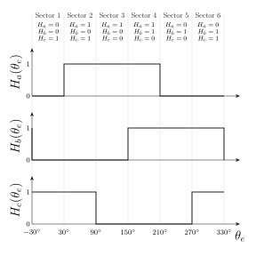
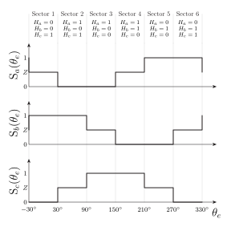
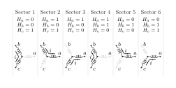
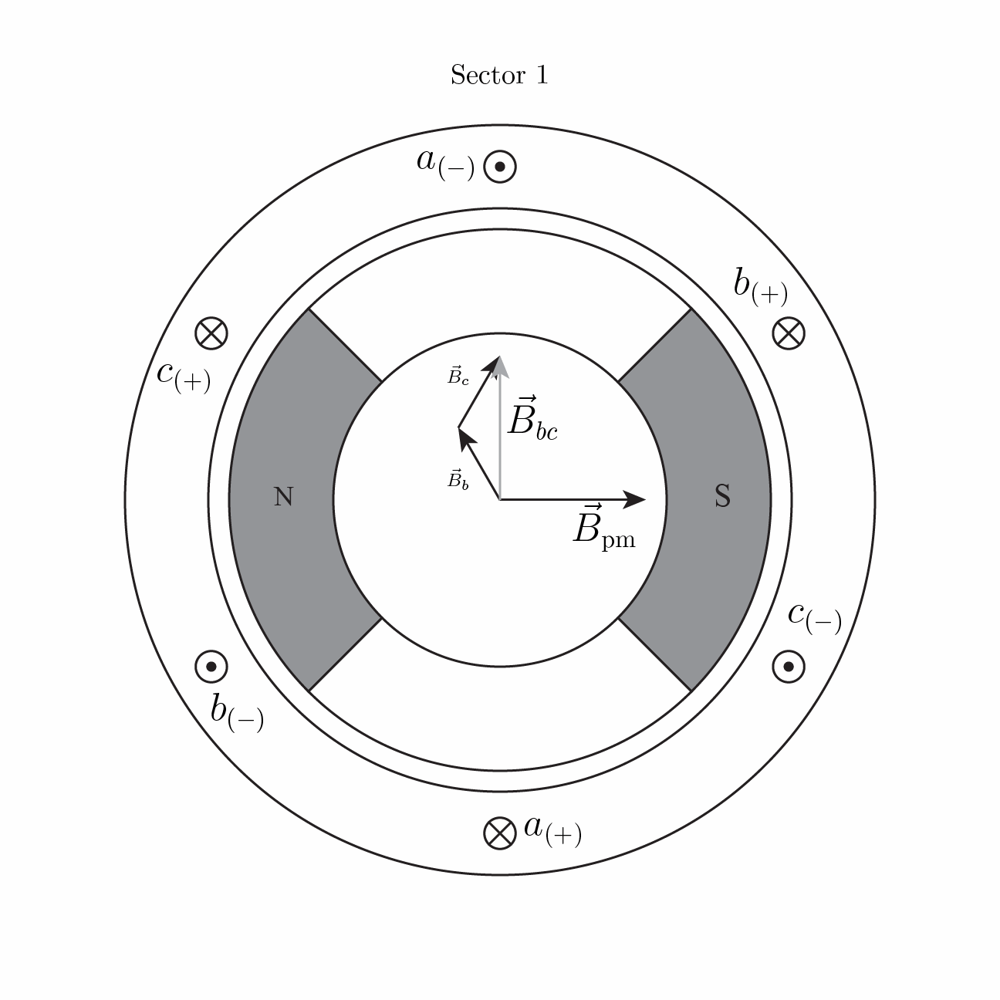
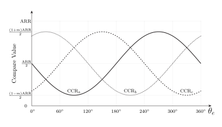

**Commutation** is the process of changing the stator excitation as the rotor turns so that current continues to produce torque in the desired direction. A brushless motor requires electronic commutation because it has no mechanical commutator.

## Three Useful Levels of Commutation

> [!table]
> | Method                        | Rotor information                                               | Applied excitation                                      | Typical reason to use it                                      |
> | ----------------------------- | --------------------------------------------------------------- | ------------------------------------------------------- | ------------------------------------------------------------- |
> | Six-step or block commutation | Six electrical sectors, often from three Hall sensors           | Two phases driven and one phase floating in each sector | Simple, inexpensive, and well supported by monolithic drivers |
> | Sinusoidal commutation        | Finer electrical-angle estimate                                 | Approximately sinusoidal phase currents or voltages     | Smoother torque and lower acoustic excitation                 |
> | Field-oriented control (FOC)  | Continuous electrical-angle estimate and phase-current feedback | Regulated $d$- and $q$-axis currents synthesized by PWM | Precise torque control and high dynamic performance           |
>
>  Three useful levels of commutation, in order of increasing complexity.

The ME5305 core path emphasizes Hall-sensored six-step commutation and driver selection. Sinusoidal commutation and FOC are included so students can recognize the terms and evaluate whether a driver IC provides them.

## Hall-Effect Rotor-Position Sensors

Many small motors contain three digital Hall-effect switches. Their outputs change as rotor poles pass the sensors. With appropriate placement, the three signals divide an electrical revolution into six sectors of $60^\circ$ electrical each. The Hall signals identify a sector rather than the exact rotor angle within that sector.

The example below uses the same angle datum as the motor model: $\theta_e=0$ when the rotor permanent-magnet field is aligned with the positive phase-$a$ magnetic axis, and positive $\theta_e$ is counterclockwise. Sector 1 is centered on this datum and extends from $-30^\circ$ to $30^\circ$ electrical. The remaining sectors follow in $60^\circ$ increments.

Three binary Hall signals permit eight codes, but only six normally occur in a correctly operating six-sector sequence. Codes `000` and `111` are commonly treated as invalid. For increasing $\theta_e$, the mapping used in the figure is

```text
001 → 101 → 100 → 110 → 010 → 011 → repeat
```

Only one Hall bit changes at each ideal sector boundary. Decreasing $\theta_e$ traverses the codes in the opposite order. This mapping is only an example: actual Hall order and polarity depend on sensor placement, connector pinout, phase wiring, and direction of rotation. Use the motor documentation or determine the mapping experimentally at low energy.

> [!figure]
> 
> Example three-Hall sequence for increasing electrical angle $\theta_e$.
> 
> The dotted boundaries divide one electrical revolution into six $60^\circ$ sectors. The code written above each sector is ordered as $H_aH_bH_c$. Only one ideal Hall channel changes at each boundary; the mapping is motor- and wiring-dependent, and reverse rotation traverses the codes in the opposite order.

## Six-Step Commutation

In six-step commutation, two phases are intentionally driven while the third phase is left floating. Define the ideal leg-state command

$$
S_x\in\{1,0,Z\},
\qquad x\in\{a,b,c\},
$$

where

- $S_x=1$ requests that phase $x$ be connected toward the positive DC bus,
- $S_x=0$ requests that phase $x$ be connected toward the DC return, and
- $S_x=Z$ requests a high-impedance state in which neither switch in that leg is intentionally on.

Here $S_x$ is an abstract command state, not necessarily the voltage on one physical MCU pin. A particular motor driver may encode these three states with two logic inputs, a PWM input plus an enable input, a serial command, or internal Hall-commutation logic. Even when $S_x=Z$, winding current may temporarily establish a phase voltage through body-diode conduction or synchronous freewheeling.

The signal names and STM32-aligned timer terms used below are collected in the short [[BLDC Notation and Signal Glossary]].

With the established back-EMF convention, the following ideal sequence produces positive torque for increasing $\theta_e$. At a sector boundary, the half-open intervals assign the boundary to the sector on its right; $330^\circ$ is equivalent to $-30^\circ$ in the next electrical revolution.

> [!table]
> | Sector | Electrical-angle interval | Hall code $H_aH_bH_c$ | $S_a$ | $S_b$ | $S_c$ | Ideal driven path              |
> | -----: | ------------------------- | :-------------------: | :---: | :---: | :---: | ------------------------------ |
> |      1 | $[-30^\circ,30^\circ)$    |         `001`         |  $Z$  |  $1$  |  $0$  | $b\rightarrow c$; $a$ floating |
> |      2 | $[30^\circ,90^\circ)$     |         `101`         |  $0$  |  $1$  |  $Z$  | $b\rightarrow a$; $c$ floating |
> |      3 | $[90^\circ,150^\circ)$    |         `100`         |  $0$  |  $Z$  |  $1$  | $c\rightarrow a$; $b$ floating |
> |      4 | $[150^\circ,210^\circ)$   |         `110`         |  $Z$  |  $0$  |  $1$  | $c\rightarrow b$; $a$ floating |
> |      5 | $[210^\circ,270^\circ)$   |         `010`         |  $1$  |  $0$  |  $Z$  | $a\rightarrow b$; $c$ floating |
> |      6 | $[270^\circ,330^\circ)$   |         `011`         |  $1$  |  $Z$  |  $0$  | $a\rightarrow c$; $b$ floating |
>
> Hall sensor commutation lookup table.

> [!figure]
> 
>*Example Hall-sensored six-step commutation sequence for positive torque and increasing electrical angle.*
>The datum $\theta_e=0$ matches the motor and back-EMF model: the rotor permanent-magnet field is aligned with the positive phase-$a$ magnetic axis. Each Hall code identifies a $60^\circ$ electrical sector. The ideal commands $S_x=1$, $S_x=0$, and $S_x=Z$ request the high-side, low-side, and high-impedance leg states, respectively. In the winding diagrams, black windings carry the idealized driven current and gray windings are floating; the arrows show the actual conduction direction rather than redefining the positive phase-current references. The rotor arrow represents $\vec B_{\mathrm{pm}}$ at the center of each sector. The rotor drawings use one pole pair for clarity; in general, $\theta_e=p\theta_m$, so the six-sector sequence repeats $p$ times per mechanical revolution. High-frequency PWM, dead time, current ripple, and driver-specific freewheel paths are omitted.

The table defines one internally consistent Hall and phase-excitation mapping, not a universal lookup table. To implement six-step commutation on an unfamiliar motor, associate each observed Hall code with the appropriate driven phase pair and verify the result at low energy. Reversing the desired torque while holding rotor position fixed swaps the high and low commands for the two active phases. Reversing the direction of rotor motion causes the measured Hall codes to occur in the reverse order.

> [!figure]
> 
> *Ideal tri-state phase commands for the example six-step sequence.*
>The levels show the requested sector states; PWM, dead time, and current recirculation are omitted.

### Physical interpretation

Within each ideal sector, current enters the motor through the phase commanded high, passes through that phase winding to the conceptual neutral point, and leaves through the winding of the phase commanded low. The third phase is not intentionally driven. The bottom two rows of Figure 2 pair this current path with the rotor orientation at the center of the sector. Under the selected conventions, the resulting stator excitation continues to pull the rotor in the positive direction as $\theta_e$ increases.

Actual winding current does not change instantaneously at a sector boundary. Inductance, back-EMF, PWM, dead time, and the selected freewheel strategy determine how current transfers between phases. Figures 2 and 4 therefore show the ideal commanded path used to understand the sequence, not every instantaneous semiconductor-conduction state.

> [!figure]
> 
>*Ideal winding-current path in each six-step sector.*
>Black windings are intentionally driven, gray windings are floating, and arrows show conventional current from the phase connected toward the positive DC bus to the phase connected toward the DC return.

> [!figure]
> 
> *Rotor permanent-magnet orientation at the center of each electrical sector for the one-pole-pair illustration.*
> The corresponding stator current pattern produces positive torque as the rotor advances from left to right.

Torque or speed is commonly adjusted by applying PWM to one of the active legs, or by using a driver-specific recirculation pattern. The exact strategy changes current ripple, switching loss, braking behavior, and current-sense visibility. The implementation developed below applies PWM to the phase whose abstract state is $S_x=1$ and uses the low-side zero state for synchronous slow decay.

> [!figure]
> 
> *Animated relationship among phase excitation, the resultant stator field, and rotor orientation during one electrical revolution of ideal six-step commutation.*
> Each 1.5-second frame shows the center of one sector. The two driven phase-field components combine into the labeled resultant stator field, which advances in $60^\circ$ steps and remains ahead of the rotor permanent-magnet field $\vec B_{\mathrm{pm}}$ for positive torque under the selected conventions. The $\otimes$ and $\odot$ symbols show the positive-current reference directions into and out of the page for the $(+)$ and $(-)$ conductors. Figures 2 and 5 provide static views of the same sector sequence.

### From commutation state to gate drive

The block-commutation table describes each phase with the abstract state $S_x\in\{1,0,Z\}$. The microcontroller must translate that three-state request into timer settings and binary logic signals that the assumed gate-driver interface can accept. Figure 7 shows this signal flow using STM32-aligned timer terminology. It is a feedforward signal-flow diagram rather than a feedback-control diagram; the physical dependence of the Hall signals on rotor position is not drawn as a return path.

> [!figure]
> ![Signal-flow block diagram for three-phase Hall-sensored block commutation. Hall channels and a direction command feed Hall decoding and the commutation lookup, which produce abstract phase states. Firmware maps those states and a duty request into per-phase enable and timer compare values. Three center-aligned PWM channels share an STM32 timer counter and produce binary gate-driver inputs. Gate-driver blocks insert dead time and produce high- and low-side gate-source voltages for the three inverter half bridges, whose pole voltages drive the motor.](../Images/BLDC/block_commutation_block_diagram.svg)
> Signal flow for Hall-sensored block commutation using synchronous slow decay and STM32-aligned timer terminology.
>
> The Hall code and direction command $\mathrm{DIR}$ select the abstract states $S_a$, $S_b$, and $S_c$. Firmware maps those states and the duty request $d$ into the driver enables $\mathrm{EN}_x$ and timer compare values $\mathrm{CCR}_x$. The three PWM channels share the timer count $\mathrm{CNT}$, auto-reload value $\mathrm{ARR}$, and prescaler $\mathrm{PSC}$. Each binary output $\mathrm{IN}_x$ enters a gate driver that inserts dead time before producing $v_{\mathrm{GS,H},x}$ and $v_{\mathrm{GS,L},x}$. Power connections, protection and fault handling, current sensing, and device-specific configuration interfaces are omitted.

For the active-high PWM convention used here, the timer output is high while $\mathrm{CNT}<\mathrm{CCR}_x$. The exact endpoint behavior and register scaling depend on the selected microcontroller timer, but the conceptual state mapping is:

> [!table]
> | Abstract state $S_x$ | $\mathrm{EN}_x$ | Timer compare value $\mathrm{CCR}_x$ | Resulting $\mathrm{IN}_x$ | Purpose                                                              |
> | :------------------: | :-------------: | ------------------------------------ | ------------------------- | -------------------------------------------------------------------- |
> |         $1$          |       $1$       | Approximately $d\cdot\mathrm{ARR}$   | Center-aligned PWM        | Alternate the active phase between the high-side and low-side states |
> |         $0$          |       $1$       | $0$                                  | $0$                       | Continuously request the low-side state                              |
> |         $Z$          |       $0$       | Ignored; set to a safe value         | Don't care                | Disable both switches in the leg                                     |
>
> Truth table decoding the tri-state abstract state $S_x$ into binary $\mathrm{IN}_x$ and $\mathrm{EN}_x$ signals.

The assumed driver then interprets $\mathrm{EN}_x$ and $\mathrm{IN}_x$ as follows:

> [!table]
> | $\mathrm{EN}_x$ | $\mathrm{IN}_x$ | High-side request | Low-side request | Requested leg state |
> | :---: | :---: | :---: | :---: | :---: |
> | $0$ | $X$ | Off | Off | $Z$ |
> | $1$ | $0$ | Off | On | $0$ |
> | $1$ | $1$ | On | Off | $1$ |
>
> Truth table decoding the binary $\mathrm{IN}_x$ and $\mathrm{EN}_x$ signals into inverter-leg behavior.

Here $X$ means that the input is ignored. When $\mathrm{EN}_x=1$ and $\mathrm{IN}_x$ changes, the gate driver temporarily requests both switches off to insert dead time. Actual gate-source voltages have finite propagation and transition times, so the MOSFET conduction state does not change instantaneously with the logic input.

#### Sector 6 with synchronous slow decay

In sector 6, Hall code `011` selects

$$
(S_a,S_b,S_c)=(1,Z,0).
$$

The timer and driver command mapping is therefore

$$
(\mathrm{EN}_a,\mathrm{EN}_b,\mathrm{EN}_c)=(1,0,1),
$$

$$
\mathrm{CCR}_a\approx d\,\mathrm{ARR},
\qquad
\mathrm{CCR}_b=0\quad\text{(ignored while }\mathrm{EN}_b=0\text{)},
\qquad
\mathrm{CCR}_c=0.
$$

The phase-$a$ driver input $\mathrm{IN}_a$ is the PWM waveform, $\mathrm{IN}_b$ is ignored because phase $b$ is disabled, and $\mathrm{IN}_c=0$ continuously requests the phase-$c$ low-side state. When $\mathrm{IN}_a=1$, the inverter applies the motoring state $(1,Z,0)$ and drives current from phase $a$ to phase $c$. When $\mathrm{IN}_a=0$, phases $a$ and $c$ are both commanded low, giving the zero state $(0,Z,0)$ used for synchronous slow decay. Phase $b$ remains floating throughout the sector.

This example fixes one decay strategy so that the signal path is explicit. Other drivers or applications may use a high-impedance interval, diode freewheeling, high-side recirculation, or a different input encoding. Follow the selected driver data sheet when converting the abstract states into physical input signals.

Figure 8 extends the same mapping across three consecutive sectors at a constant $50\%$ duty request. The PWM waveform moves from phase $c$ in sector 4 to phase $a$ in sectors 5 and 6 because the phase commanded by $S_x=1$ changes with the commutation table. At each boundary, the enable pattern changes so that the newly floating phase is disabled and the two active phases implement the next driven current path.

> [!figure]
> 
> Physical driver-interface signals for sectors 4, 5, and 6 using synchronous slow decay and a constant duty request $d=50\%$.
>
> The Hall code and abstract state tuple above each sector come from the six-step table. A phase with $S_x=1$ has $\mathrm{EN}_x=1$ and a PWM waveform on $\mathrm{IN}_x$; a phase with $S_x=0$ has $\mathrm{EN}_x=1$ and $\mathrm{IN}_x=0$; and a phase with $S_x=Z$ has $\mathrm{EN}_x=0$, making its shaded $\mathrm{IN}_x$ value a don't-care condition. Only a few PWM cycles are drawn per sector for legibility; in normal operation, the PWM frequency is much higher than the electrical commutation frequency.

### Low-energy bring-up

Before driving an unfamiliar motor at full bus voltage:

1. Confirm phase-to-phase winding continuity and isolation from the frame.
2. Rotate the shaft slowly and record the Hall-code sequence in both directions.
3. Verify that only six valid codes occur and that only one Hall bit changes at each boundary.
4. Identify the phase order and connect it to the driver's expected order.
5. Use a current-limited supply and a low command while checking direction, current, and temperature.
6. Stop if the rotor locks, chatters, reverses unexpectedly, or draws excessive current; those symptoms often indicate a phase/Hall mapping error.

## Incremental Encoders

An incremental encoder commonly provides quadrature channels $A$ and $B$, plus an optional index channel $Z$. The phase relationship between $A$ and $B$ gives direction, and counted edges give relative position.

An incremental encoder does not automatically provide absolute rotor electrical angle at power-up. A controller may need an index search, a known alignment pulse, stored calibration, or additional absolute information before applying high-performance commutation. Mechanical encoder angle must also be converted to electrical angle and corrected for the offset between encoder zero and the rotor magnetic axis:

$$
\theta_e=p\theta_m+\theta_{e,0}.
$$

The offset $\theta_{e,0}$ is a calibrated quantity whose sign depends on the selected angle convention.

## Resolvers and Absolute Position Sensors

A resolver uses an excited winding and two approximately sinusoidal output channels to encode shaft angle. Interface electronics excite the carrier, condition and demodulate the returned signals, and estimate angle. Dedicated resolver-to-digital converters are common because the raw signals are not logic-level sine and cosine values that can simply be connected to a microcontroller.

Magnetic and optical absolute encoders can also report shaft angle directly. Regardless of sensor technology, a commutation system must know resolution, latency, direction, pole-pair count, and the electrical-zero offset.

## Sinusoidal PWM and Field-Oriented Control

Sinusoidal commutation commands three smooth phase waveforms displaced by $120^\circ$ electrical. Space-vector PWM (SVPWM) is another way to synthesize the requested three-phase average voltage from the same inverter. The detailed switching-vector hexagon and dwell-time derivation are intentionally deferred from the core notes.

In a center-aligned implementation, the desired sinusoidal phase commands can be represented as compare-register trajectories centered on $\mathrm{ARR}/2$. The timer still produces binary $\mathrm{IN}_x$ waveforms by comparing its rapidly varying $\mathrm{CNT}$ value with these slowly varying compare values; the smooth curves in Figure 9 are therefore duty commands, not motor-terminal voltages or phase currents.


> [!figure]
> 
> Example sinusoidal compare-register commands $\mathrm{CCR}_a$, $\mathrm{CCR}_b$, and $\mathrm{CCR}_c$ over one electrical revolution.
>
> The three commands are separated by $120^\circ$ electrical and centered on $\mathrm{ARR}/2$. In the figure, $m$ denotes their normalized modulation depth, so the extrema are $(1-m)\mathrm{ARR}/2$ and $(1+m)\mathrm{ARR}/2$.


FOC uses the measured electrical angle to express the measured phase currents in coordinates that rotate with the rotor. For the surface-PMSM operating region emphasized here, the direct-axis current command is normally $i_d^*=0$, while the quadrature-axis command $i_q^*$ sets the requested torque. Separate current controllers produce the rotating-frame voltage commands $v_d^*$ and $v_q^*$, which are transformed back into three-phase voltage commands for the PWM inverter.

> [!figure]
> ![Closed-loop field-oriented current controller. Direct- and quadrature-axis current commands are compared with measured current components and passed through separate PI controllers. The resulting voltage commands pass through an inverse Park and Clarke transform, the PWM inverter, and the motor electrical dynamics. Motor phase currents pass through shunt-resistor sensing, amplification, analog-to-digital conversion, current reconstruction, and a Clarke and Park transform before returning to the current controllers. A rotor-position sensor and electrical-angle calculation provide the measured electrical angle to both transforms. Electromagnetic torque and load torque feed the separate mechanical-system dynamics.](../Images/BLDC/FOC_current_loop.svg)
> High-level inner current-control loop for surface-PMSM FOC.
>
> The $d$- and $q$-axis PI controllers regulate $i_d$ and $i_q$ and produce the voltage commands $v_d^*$ and $v_q^*$. The inverse Park/Clarke transform uses the measured electrical angle $\theta_{e,\mathrm{meas}}$ to form the stationary three-phase command $\mathbf v_{abc}^*$. The sensing path illustrates phase-current measurement using shunt resistors, a programmable-gain amplifier (PGA), an analog-to-digital converter (ADC), and current reconstruction before the measured currents $\mathbf i_{abc,\mathrm{meas}}$ are transformed into $\mathbf i_{dq}$. The rotor-position path measures shaft angle and applies the pole-pair count and calibrated offset so that $\theta_{e,\mathrm{meas}}=p\theta_{m,\mathrm{meas}}+\theta_{e,0}$. A resolver or other position sensor could replace the encoder-based path, while a sensorless estimator would infer electrical angle from available electrical measurements and the motor model. Detailed current-controller decoupling, voltage saturation, anti-windup, field weakening, maximum-torque-per-ampere control, and PWM switching are omitted.

Figure 10 begins with the current commands and therefore does not show an outer speed or position loop. The command $i_q^*$ may be calculated directly from a requested torque or supplied by an outer speed controller; a position controller may in turn surround the speed loop. These outer loops change how $i_q^*$ is generated, but they do not change the basic inner current-loop structure shown here. The illustrated current-sensing chain is also representative rather than universal: a particular motor driver may measure all three phase currents, reconstruct one or more currents from fewer shunts, or integrate some of the amplification and conversion circuitry.

## Choosing the Position Interface

For a small mechatronic system, ask:

- Does the motor already include Hall sensors or an encoder?
- Does the driver accept those signals directly, or must the microcontroller decode them?
- Is position needed only for commutation, or also for mechanism feedback?
- Is valid absolute angle required immediately at startup?
- Does the sensor resolution support the selected commutation method and speed range?
- Are logic levels, pullups, cable shielding, filtering, and connector pinout compatible?
- How will direction, pole-pair count, and electrical-zero offset be calibrated and verified?

## Related Notes

- [[Motor Theory Fundamentals]]
- [[BLDC Motor Model]]
- [[Three-Phase Inverters]]
- [[BLDC Notation and Signal Glossary]]
