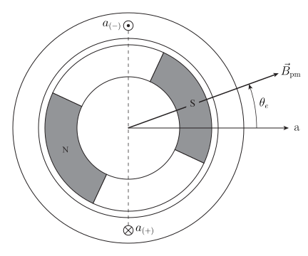
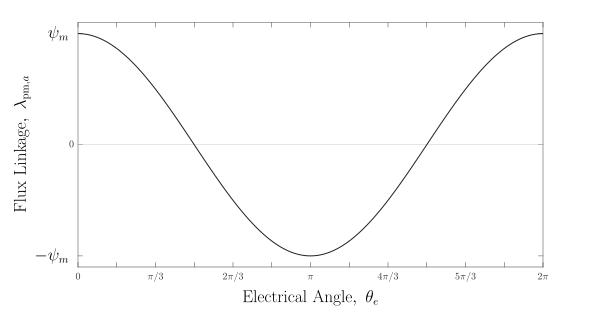
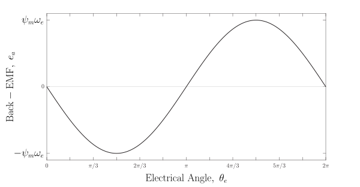

> [!note] Scope and terminology
> In these notes, **BLDC motor** means the broad class of brushless permanent-magnet synchronous motors with approximately sinusoidal back-EMF. Some vendors reserve *BLDC* for trapezoidal-back-EMF machines and use *PMSM* for sinusoidal machines. Always check the manufacturer's terminology.

This note develops only the physical ideas needed to interpret a small brushless motor and its driver: flux linkage, back-EMF, electromagnetic torque, and the relationship between electrical and mechanical angle. A detailed electromagnetic field derivation is outside the scope of this module.

## Naming and Notation Conventions

The naming convention and notation style used throughout this lecture series are collected in the [[BLDC Notation and Signal Glossary]].

## A One-Phase Thought Experiment

Begin with a stationary coil and a permanent-magnet rotor. The rotor field links the coil differently as the rotor turns. That changing flux linkage produces a voltage at the coil terminals.

> [!figure] Figure 1
> 
>
> *Cross-sectional view of a simplified one-phase permanent-magnet motor.*
>
> The $\otimes$ and $\odot$ symbols indicate current directed into and out of the page, respectively. For positive $i_a$, current enters the page at $a_{(+)}$ and leaves the page at $a_{(-)}$. By the right-hand rule, the positive magnetic axis of the winding points along the positive $\mathrm{a}$-axis shown in the figure. Rotor orientation is defined by the counterclockwise electrical angle $\theta_e$, measured from the positive $\mathrm{a}$-axis to the idealized permanent-magnet field vector $\vec B_\mathrm{pm}$. The figure assumes one pole pair ($p=1$), so $\theta_e=\theta_m$; in general, $\theta_e=p\theta_m$.

### Flux linkage

Magnetic flux linkage, $\lambda$, measures how strongly magnetic flux links all turns of a winding. In the idealized motor, assume that the rotor magnet produces a sinusoidal permanent-magnet flux linkage in phase $a$:

$$
\lambda_{\mathrm{pm},a}(\theta_e)=\psi_m\cos\theta_e,
$$

where $\psi_m$ is the peak permanent-magnet flux linkage of one phase.

> [!figure] Figure 2
> 
>
> *Idealized permanent-magnet flux linkage versus rotor electrical angle.*
>
> In the idealized one-phase motor, the permanent-magnet field is assumed to have constant magnitude and a uniform spatial distribution while its direction rotates with the rotor. Consequently, the flux linkage of phase $a$ varies sinusoidally with electrical angle $\theta_e$.

### Back-EMF

The permanent-magnet back-EMF is the time derivative of the permanent-magnet flux linkage when the phase-voltage polarity is defined as the drop from the positive terminal $a_{(+)}$ to the negative terminal $a_{(-)}$:

$$
e_a=\frac{d\lambda_{\mathrm{pm},a}}{dt}.
$$

Applying the chain rule gives

$$
\begin{aligned}
e_a
&=\frac{d\lambda_{\mathrm{pm},a}}{d\theta_e}\frac{d\theta_e}{dt} \\
&=-\psi_m\omega_e\sin\theta_e,
\end{aligned}
$$

where $\omega_e=d\theta_e/dt$ is electrical angular speed. The negative sign is a consequence of the selected angle, terminal polarity, and flux-linkage definitions.

> [!figure] Figure 3
> 
>
> *Idealized phase-$a$ back-EMF versus rotor electrical angle at constant speed.*
>
> For constant positive electrical speed $\omega_e$, the back-EMF follows $-\sin\theta_e$: it is zero when the rotor field is aligned with the phase-$\mathrm{a}$ axis and reaches its peak magnitude $\psi_m\omega_e$ one-quarter electrical revolution later.

## Electromagnetic Torque

Ignoring losses, the instantaneous electrical power converted to mechanical power by one phase is

$$
p_{\mathrm{conv},a}=e_a i_a=T_{e,a}\omega_m.
$$

For the one-pole-pair model, $\omega_e=\omega_m$, so

$$
T_{e,a}=\frac{e_a i_a}{\omega_e}=-\psi_m i_a\sin\theta_e.
$$

Positive average torque therefore requires the phase current to be synchronized with rotor position. For example, with the sign convention above, choose

$$
i_a=-\hat I_a\sin\theta_e,
$$

where $\hat I_a>0$ is the peak phase current. This current produces nonnegative instantaneous torque:

$$
T_{e,a}=\psi_m\hat I_a\sin^2\theta_e.
$$

A practical motor uses three displaced windings so that their combined torque is much smoother than the torque from this one-phase thought experiment.

## Electrical and Mechanical Angle

The main derivation assumes one rotor pole pair:

$$
p=1,
\qquad
\theta_e=\theta_m,
\qquad
\omega_e=\omega_m.
$$

For a motor with $p$ pole pairs, the general relationship is

$$
\theta_e=p\theta_m,
\qquad
\omega_e=p\omega_m.
$$

The one-pole-pair assumption keeps the geometry readable, but it must not be carried into a real motor's speed or commutation calculations without checking the motor pole count.

## Motor Constants and Datasheet Conventions

A phase-peak back-EMF constant referenced to mechanical speed can be introduced through

$$
\hat E_{\mathrm{phase}}=K_e\omega_m.
$$

Because $\hat E_{\mathrm{phase}}=\psi_m\omega_e$ and $\omega_e=p\omega_m$,

$$
K_e=p\psi_m.
$$

Therefore, $K_e=\psi_m$ for the one-pole-pair model used in the main derivation. A manufacturer's reported value may differ numerically if it uses line-to-line rather than phase voltage, RMS rather than peak voltage, or a speed unit other than radians per second.

The torque constant $K_t$ similarly depends on how current is defined. Do not assume two numerical constants are directly comparable until all of the following are known:

- phase or line-to-line voltage,
- peak, RMS, or average voltage,
- mechanical or electrical angular speed,
- phase, line, peak, or RMS current, and
- SI units or a vendor-specific speed constant such as rpm/V.

## What to Carry Forward

- Rotor motion changes permanent-magnet flux linkage and therefore produces back-EMF.
- Back-EMF magnitude increases with speed.
- Torque depends on both current magnitude and current alignment with the rotor field.
- Electrical angle advances by one revolution per pole pair for each mechanical revolution.
- Sign and scaling conventions are choices, but every equation, plot, sensor mapping, and driver connection must use the same choices.

## Related Notes

- [[BLDC Motor Model]]
- [[Three-Phase Inverters]]
- [[Hall-Effect Sensors Encoders and Commutation]]
