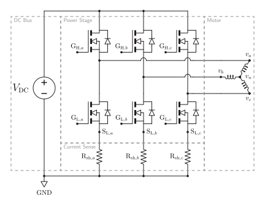
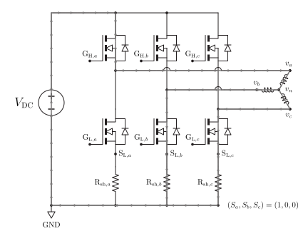
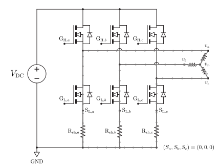
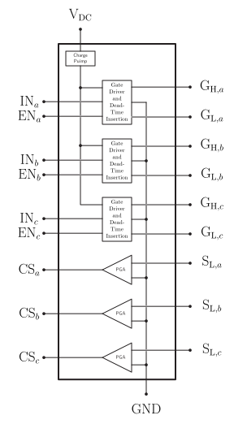
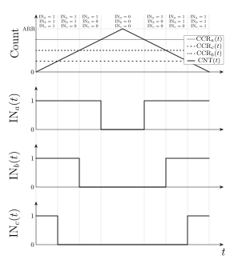
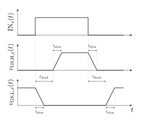
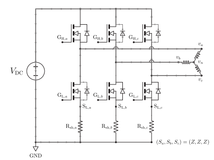
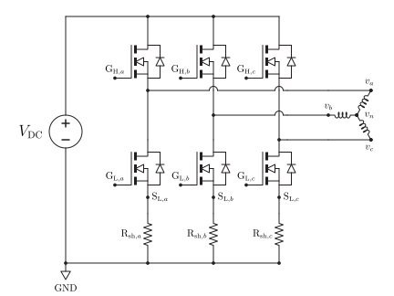
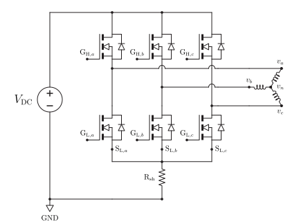
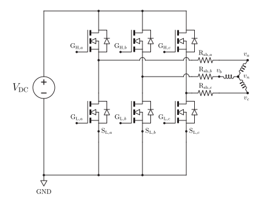

A three-phase inverter connects a DC source to the three motor terminals with three half bridges. By controlling the six semiconductor switches, the inverter establishes phase-current direction and magnitude. A monolithic motor-driver IC may integrate only the gate drivers, or it may integrate the gate drivers, power transistors, current sensing, commutation logic, and control loops.

## The Three Half Bridges

Each motor terminal is connected to the midpoint of one half bridge. The high-side switch connects that terminal toward the positive DC bus; the low-side switch connects it toward the negative DC bus. Modern small-motor drivers normally use MOSFETs, either integrated in the IC or connected externally.

> [!figure]
> 
> *Simplified three-phase inverter power stage with six N-channel MOSFETs, their body diodes, three low-side current-shunt resistors $R_{\mathrm{sh},x}$, and a wye-connected motor. The dashed boundaries distinguish the DC bus, power stage, current-sense elements, and motor. The pole potentials $v_a$, $v_b$, and $v_c$, the floating neutral potential $v_n$, and the sense nodes $\mathrm{S}_{\mathrm L,x}$ are all referenced to GND. Figure 4 separates the gate-driver and current-sense-amplifier functions from this power schematic.*

> [!figure]
> 
>
> *Driven current path for the ideal switching state $(S_a,S_b,S_c)=(1,0,0)$. Current passes through the phase-$a$ high-side MOSFET, enters motor phase $a$, divides between phases $b$ and $c$, and returns through their low-side MOSFETs and shunts. The gray arrows show actual current flow for this example, not the positive phase-current reference directions.*

> [!figure]
> 
> *Low-side dynamic-braking path for the ideal zero state $(S_a,S_b,S_c)=(0,0,0)$. All three motor terminals are connected toward GND through the conducting low-side MOSFETs and shunts. For the instantaneous current directions shown, current enters phase $a$, divides between phases $b$ and $c$, and circulates through the low-side network without drawing power from the positive DC bus.*

> [!figure]
> 
> *Functional block diagram of the assumed 3×PWM motor driver. Each binary phase input $\mathrm{IN}_x$ enters a gate-driver block that controls the high- and low-side gate terminals $\mathrm{G}_{\mathrm H,x}$ and $\mathrm{G}_{\mathrm L,x}$ with complementary timing and dead-time insertion; when $\mathrm{EN}_x$ is low, both MOSFETs in that leg are disabled. The charge pump supports high-side operation. Each programmable-gain amplifier (PGA) accepts the low-side sense-node voltage $\mathrm{S}_{\mathrm L,x}$ and produces a conditioned current-sense output $\mathrm{CS}_x$ for the controller. Power pins, protection and fault circuits, configuration interfaces, and other device-specific details are intentionally omitted.*

### Gate-drive requirements

A digital controller cannot usually drive power MOSFET gates directly. A gate driver must source and sink gate current quickly and must control the high-side gate relative to the moving phase node. High-side bias may be produced with a bootstrap circuit or a charge pump.

When choosing a driver, check whether its high-side supply permits the required duty cycle and startup behavior. A bootstrap-only design may need periodic switching to refresh its charge and may not support an indefinitely on high-side device.

This note assumes a **3×PWM interface** with a binary input $\mathrm{IN}_x$ and an enable input $\mathrm{EN}_x$ for each phase leg. While $\mathrm{EN}_x=1$, the driver interprets $\mathrm{IN}_x$ as the desired high-side or low-side state and generates complementary gate commands with inserted dead time. Setting $\mathrm{EN}_x=0$ disables both switches in that leg. Some drivers instead use a **6×PWM interface**, exposing separate high- and low-side commands for all three legs. In that case, the controller is normally responsible for generating complementary signals and enforcing dead time. STM32 devices equipped with advanced-control timers can generate complementary PWM channels with hardware dead-time insertion, but the required timer and pin features must be checked for the selected device.

## Switching States and Voltage Definitions

It is useful to describe a phase leg first with the abstract state

$$
S_x=
\begin{cases}
1, & \text{request the high-side state for phase }x,\\
0, & \text{request the low-side state for phase }x,\\
Z, & \text{request the high-impedance state for phase }x,
\end{cases}
$$

for $x\in\{a,b,c\}$. This three-state description is independent of the pin encoding used by a particular driver. For the assumed interface,

$$
S_x=1\longleftrightarrow(\mathrm{EN}_x,\mathrm{IN}_x)=(1,1),
$$

$$
S_x=0\longleftrightarrow(\mathrm{EN}_x,\mathrm{IN}_x)=(1,0),
$$

and $S_x=Z$ is requested with $\mathrm{EN}_x=0$, in which case $\mathrm{IN}_x$ is ignored. These mappings describe a directly requested, unmodulated leg state. During block commutation, $S_x=1$ instead identifies the active phase whose $\mathrm{IN}_x$ signal is pulse-width modulated between the high-side and low-side requests.

Away from dead-time intervals and semiconductor voltage drops, an enabled complementary half bridge produces the pole voltage

$$
v_x\approx \mathrm{IN}_xV_\mathrm{DC},
\qquad \mathrm{EN}_x=1,
$$

relative to the negative DC bus, labeled GND in the figures. When $\mathrm{EN}_x=0$, the command does not uniquely determine $v_x$: winding current and the body-diode or freewheel path may establish the instantaneous pole potential.

This pole voltage is not generally the same as the motor phase-to-neutral voltage $v_{xn}$. With a floating wye neutral,

$$
v_{xn}=v_{x}-v_{n}.
$$

Line-to-line voltage eliminates the neutral potential. For example,

$$
v_{ab}=v_{a}-v_{b}=v_{an}-v_{bn}.
$$

Keeping pole, phase, and line-to-line voltages distinct prevents many factor-of-two and common-mode errors.

## Pulse-Width Modulation

Pulse-width modulation (PWM) switches an enabled half bridge rapidly so that the motor inductance responds primarily to an average voltage. For an ideal half bridge using active-high complementary PWM over one switching period,

$$
\overline{v}_{x}\approx d_xV_\mathrm{DC},
$$

where $0\le d_x\le1$ is the high-side duty ratio. This is an average **pole** voltage; the phase-to-neutral average also depends on the other two phase commands.

With the active-high timer convention used in Figure 5, $d_x\approx\mathrm{CCR}_x/\mathrm{ARR}$ apart from timer endpoint details. The prescaler $\mathrm{PSC}$ and auto-reload value $\mathrm{ARR}$ set the PWM period, while $\mathrm{CCR}_x$ sets the high-time fraction for phase $x$.

> [!figure]
> 
> *Center-aligned, active-high PWM for the example ordering $\mathrm{CCR}_a>\mathrm{CCR}_c>\mathrm{CCR}_b$. The common timer counter $\mathrm{CNT}(t)$ rises from zero to the auto-reload value $\mathrm{ARR}$ and then falls. Each enabled driver input $\mathrm{IN}_x$ is high while $\mathrm{CNT}<\mathrm{CCR}_x$ and low otherwise, producing the symmetric state sequence $(1,1,1)\rightarrow(1,1,0)\rightarrow(1,0,0)\rightarrow(0,0,0)$ and its reverse over one PWM period. The figure shows timer logic before gate-driver dead-time insertion; all three enables are assumed high.*

PWM frequency is normally much higher than the electrical rotation frequency. It must be high enough to limit current ripple and acoustic effects, but higher switching frequency also increases switching loss and can tighten timing and layout requirements.

## Dead Time, Shoot-Through, and Freewheeling

The high-side and low-side MOSFETs in one leg must not conduct simultaneously. That condition would short the DC bus through the half bridge and is called **shoot-through**. The device responsible for complementary timing inserts a short interval called **dead time** between turning one MOSFET off and beginning to turn the other on. Under the assumed 3×PWM interface, this function is inside the motor driver; with a 6×PWM interface, it may instead be performed by the controller timer.

Motor current cannot change instantaneously. During dead time or an inactive switching state, it continues through a MOSFET body diode or through an actively controlled MOSFET channel. These freewheel paths affect losses, voltage ripple, current measurement, and regeneration back into the DC supply.

> [!figure]
> 
> *Response of one enabled inverter leg to the binary input $\mathrm{IN}_x(t)$. After each input transition, the conducting MOSFET begins turning off and the complementary gate-source voltage does not begin rising until after the inserted delay $t_\mathrm{dead}$. The finite ramps represent the gate-voltage transition time $t_\mathrm{slew}$; the actual interval during which both MOSFET channels are off also depends on propagation delay, threshold voltage, and the driver IC's definition of dead time. The enable $\mathrm{EN}_x$ is held high in this example.*

> [!figure]
> 
> *Asynchronous freewheeling with all six gate outputs inactive. For the instantaneous phase-current directions shown, current passes from GND through the phase-$a$ shunt and low-side body diode, enters motor phase $a$, leaves through phases $b$ and $c$, and returns to the positive DC bus through their high-side body diodes. The DC link therefore receives the motor's returned energy.*

Turning every gate off does not make inductive current disappear. The current initially selects whichever body-diode paths satisfy its existing direction, as Figure 7 illustrates. If the source or DC-link circuitry cannot absorb the returned energy, the bus voltage can rise; practical drivers may therefore require suitable capacitance, clamping, braking, or supply-side energy handling.

## Current Sensing

Current feedback supports overcurrent protection, torque control, and field-oriented control. Common arrangements include:

- **Inline phase sensing:** measures each motor lead directly and offers broad observability, but the sensor and amplifier must tolerate large common-mode switching voltage.
- **Low-side leg shunts:** places one shunt in each inverter leg and is friendly to lower-common-mode amplifiers, but some switching states provide poor measurement windows.
- **DC-link shunt:** uses one sensor and low cost, but reconstructing individual phase currents requires synchronized sampling and knowledge of the active switching state.

Two measured phase currents are sufficient for a balanced three-wire motor because $i_a+i_b+i_c=0$, but that algebra does not guarantee that two useful measurements are available during every PWM interval.

> [!figure]
> 
> *Three-shunt low-side sensing places one resistor $R_{\mathrm{sh},x}$ beneath each inverter leg. The corresponding sense node $\mathrm{S}_{\mathrm L,x}$ remains near GND, which simplifies amplifier common-mode requirements. A shunt measures the associated phase current only while that leg's low-side path conducts, so PWM state and sampling time determine which measurements are useful.*

> [!figure]
> 
> *Single-shunt DC-link sensing places one resistor $R_\mathrm{sh}$ in the common inverter return. Its voltage represents the instantaneous DC-link current rather than one phase current directly. The arrangement minimizes sensing hardware but requires switching-state-dependent phase-current reconstruction and carefully timed sampling during informative PWM intervals.*

> [!figure]
> 
> *Inline phase sensing places one shunt $R_{\mathrm{sh},x}$ in series with each motor lead. Each shunt directly carries its phase current and therefore provides broad observability independent of which low-side MOSFET is on. The differential amplifier must nevertheless resolve a small shunt voltage while tolerating the rapidly changing common-mode voltage of the phase terminal.*

## Choosing a Monolithic Motor Driver

Start from the motor, supply, load, and desired commutation method. Then check:

- maximum DC-bus voltage, including supply tolerance and regenerative transients;
- continuous and peak phase current, switching losses, package thermal resistance, and available cooling;
- integrated MOSFETs versus an external-MOSFET gate driver;
- whether the IC is only a power stage, a six-step commutator, or a complete field-oriented controller;
- supported rotor-position inputs: Hall sensors, encoder, resolver interface, or sensorless estimation;
- current-sense topology, amplifier limits, ADC timing, and overcurrent response;
- PWM, direction, enable, SPI, or other control interfaces;
- high-side bias method, minimum pulse width, dead-time control, and supported PWM frequency;
- undervoltage, overvoltage, overtemperature, short-circuit, and shoot-through protection; and
- package, grounding, bypassing, power-loop layout, and exposed-pad requirements.

A current rating printed on the front page is not a complete design criterion. The safe current depends on bus voltage, PWM frequency, MOSFET resistance, thermal path, board layout, ambient temperature, and the drive waveform.

## Related Notes

- [[BLDC Motor Model]]
- [[Hall-Effect Sensors Encoders and Commutation]]
- [[BLDC Notation and Signal Glossary]]
